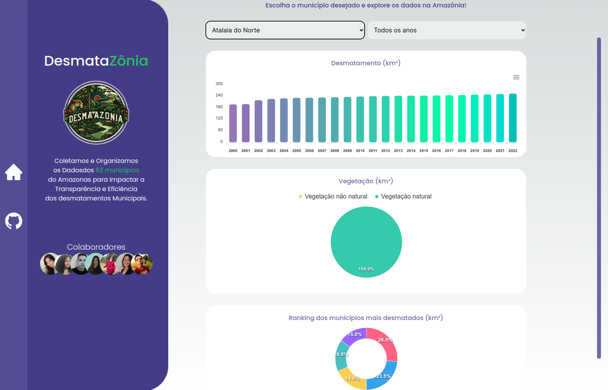

# Evolução  do projeto: Desmatazônia

## Sumário

* [Objetivo](#Objetivo)
* [Introdução](#Introdução)
* [Sobre a versão inicial](#Sobre_a_versão_inicial)
* [Sobre a versão atual](#Sobre_a_versão_atual)
* [Principais modificações](#Principais_modificações)
* [Conclusão](#Conclusão)
* [Histórico de Versão](#Histórico_de_Versão)

## Objetivo

  Este documento tem como objetivo registrar a evolução dos protótipos a medida em que o projeto foi desenvolvido.

## Introdução

  Inicialmente, o foco estava na busca por informações sobre licitações, retiradas do site do Diário Oficial do Amazonas. No entanto, devido a limitações temporais desses dados, que iam até 2020, e pelo tema de licitações ser muito abrangente, a professora orientou que o escopo fosse ajustado para concentrar-se em dados de desmatamento nos municípios do Amazonas. Com isso, esta mudança levou a uma reestruturação do projeto e à utilização da plataforma basedosdados.org, que oferece um conjunto de dados ambientais tratados, os quais abrangem o período de 2000 a 2022.

## Sobre a versão inicial

  Na versão inicial do projeto, o foco estava na extração de dados relacionados a licitações no estado do Amazonas. Para isso, foi utilizado um extrator de dados para realizar buscas automatizadas no Diário Oficial do Amazonas, obtendo informações sobre processos licitatórios. Assim, o extrator permitiu a coleta de dados relevantes, incluindo detalhes sobre contratos, empresas envolvidas e valores licitados. 

  No entanto, um desafio significativo surgiu devido à limitação temporal desses dados, que se estendiam apenas até o ano de 2020, além de o fato de as informações sobre as licitações não serem as mais interessantes para serem trabalhadas sobre o Amazonas. Essas restrições motivaram uma revisão estratégica do escopo do projeto, levando à transição para dados de desmatamento nos municípios do Amazonas, uma abordagem mais abrangente e impactante para o contexto ambiental da região. 

  ### Sobre o protótipo inicial:

  **Ideias para os gráficos iniciais.**

  

  

  

**Protótipos iniciais**

  

  

## Sobre a versão atual

Após as modificações no projeto, foi decidido que seria utilizada a plataforma [basedosdados.org](https://basedosdados.org/) como fonte principal, pois ela permitiu que fosse obtido um conjunto de dados extenso e atualizado, abrangendo o período de 2000 a 2022. Consequentemente, esta mudança permitiu uma análise mais abrangente e contextualizada das tendências de desmatamento na região amazônica.

Além disso, com os dados mostrados em formas de gráficos, é possível visualizar de forma mais robusta o impacto ambiental ambiental na Amazônia, o que proporciona uma abordagem mais relevante e impactante para o contexto atual.

**Protótipos finais**

  

  

## Principais modificações

### Fonte de Dados:
  - A principal modificação foi a transição da fonte de dados do Diário Oficial do Amazonas para o basedosdados.org, proporcionando um conjunto mais abrangente e atualizado para análise.
  - Além disso, o basedosdados.org já proporciona os dados tratados, o que facilitou a sua inclusão no projeto.

### Escopo do projeto:
  - O escopo do projeto evoluiu de licitações para desmatamento, alinhando-se às orientações da professora e proporcionando uma abordagem mais relevante e impactante para o contexto ambiental da Amazônia.

### Análise de Dados:
  - A natureza dos dados de desmatamento permitiu uma análise mais aprofundada das tendências ao longo dos anos, fornecendo uma visão mais holística e significativa sobre as mudanças ambientais.

## Conclusão

A evolução dos protótipos refletiu a adaptabilidade do projeto diante de novos desafios e requisitos, o que incluiu a mudança de fonte de dados, do Diário Oficial do Amazonas para o basedosdados.org e fortaleceu nossa capacidade analítica. Logo, este documento servirá como referência para as lições aprendidas ao longo do processo, proporcionando insights valiosos para futuras iterações e melhorias no projeto.

 ## Histórico de Versão
| Versão | Alteração | Responsável | Revisor | Data |
| - | - | - | - | - |
| 1.0 | Criação| Larissa Stéfane | - | 11/12/2023

